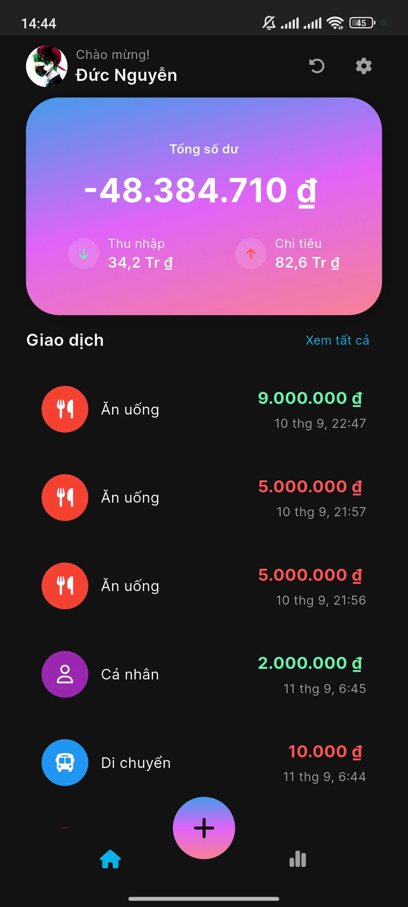
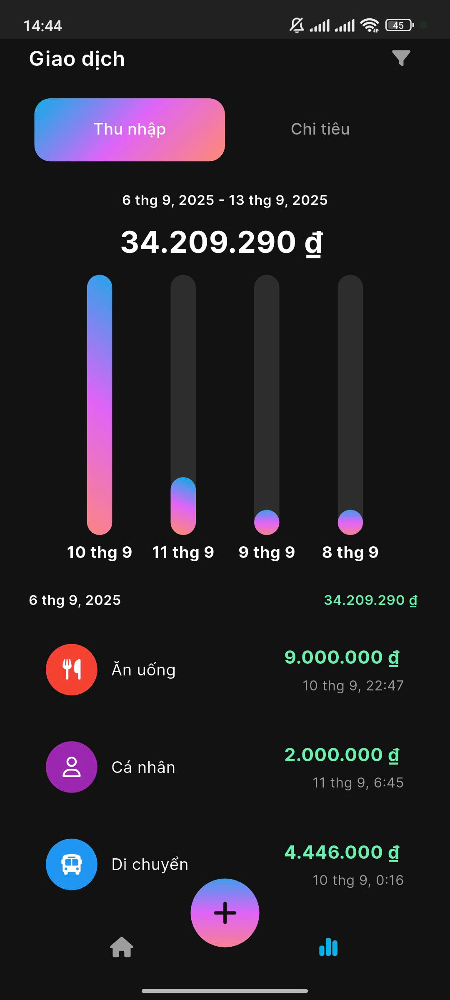
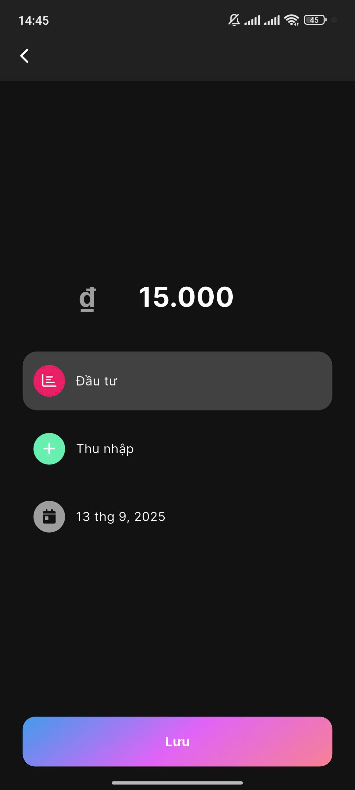

# GenZ Money Mate

Ứng dụng quản lý tài chính đơn giản được phát triển bằng Flutter, giúp bạn theo dõi chi tiêu hàng ngày và quản lý ngân sách cá nhân một cách hiệu quả.

## 📱 Tính năng chính

- **Theo dõi chi tiêu**: Ghi chép các khoản thu chi hàng ngày
- **Quản lý số dư**: Hiển thị tổng số dư hiện tại và lịch sử giao dịch
- **Thống kê tài chính**: Biểu đồ và phân tích chi tiêu theo danh mục
- **Giao diện thân thiện**: Thiết kế đơn giản, dễ sử dụng
- **Đa ngôn ngữ**: Hỗ trợ tiếng Việt, tiếng Anh và tiếng Trung

## 🖼️ Ảnh demo

<table>
<tr>
<td width="30%" style="padding-right: 10px;">

<br><em>Màn hình chính</em>
</td>
<td width="30%" style="padding: 0 10px;">

<br><em>Chi tiết giao dịch</em>
</td>
<td width="30%" style="padding-left: 10px;">

<br><em>Thêm thu nhập</em>
</td>
</tr>
</table>

## 🛠️ Công nghệ sử dụng

- **Flutter**: 3.29.2
- **Java**: 17
- **State Management**: BLoC Pattern
- **Database**: Firebase Firestore + Hive (local storage)
- **Authentication**: Firebase Auth
- **Charts**: FL Chart

## 📋 Yêu cầu hệ thống

- Flutter SDK 3.29.2 trở lên
- Dart SDK 3.7.0 trở lên
- Java 17
- Android Studio hoặc VS Code
- Firebase project (cho authentication và cloud storage)

## 🚀 Cài đặt và chạy ứng dụng

1. **Clone repository**
   ```bash
   git clone <repository-url>
   cd GenZ-Money-Mate
   ```

2. **Cài đặt dependencies**
   ```bash
   flutter pub get
   ```

3. **Cấu hình Firebase**
   - Tạo project Firebase
   - Thêm file `google-services.json` vào `android/app/`
   - Cấu hình Firebase Auth và Firestore

4. **Chạy ứng dụng**
   ```bash
   flutter run
   ```

## 📁 Cấu trúc dự án

```
lib/
├── core/                 # Core utilities và configurations
├── features/            # Các tính năng chính
│   ├── home/           # Màn hình chính và dashboard
│   ├── transaction/    # Quản lý giao dịch
│   ├── profile/        # Thông tin cá nhân
│   └── settings/       # Cài đặt ứng dụng
└── app/                # Main app configuration
```

